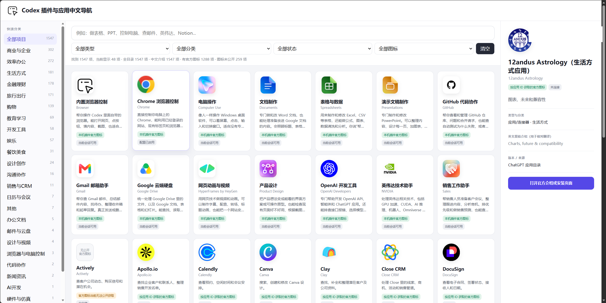

# Codex 插件与应用中文导航

一个面向中文用户的 Codex 插件、ChatGPT 应用和连接器搜索导航。打开网页后，可以用日常说法直接查找合适的工具，不需要记住准确的英文名称。

[立即在线使用](https://source-blip.github.io/codex-plugin-chinese-navigation/)

## 主要功能

- **中文搜索**：支持“做表格”“做 PPT”“查邮件”“控制电脑”“英伟达”等日常说法。
- **英文和缩写搜索**：支持插件英文名、产品名、缩写和常用关键词。
- **分类导航**：按办公、设计、开发、销售、金融、旅行、购物等用途快速筛选。
- **状态筛选**：区分可直接使用、可安装、未连接和目录草稿等状态。
- **中文介绍**：每个项目都有简明中文说明，并保留英文原始介绍方便核对。
- **官方图标**：按应用 ID 对应官方图标；无法公开获取的图标会明确标注。
- **详情查看**：点击卡片即可查看分类、用途、来源和官方介绍或安装地址。
- **离线使用**：整个导航页集中在一个 HTML 文件中，下载后可直接打开。
- **响应式界面**：支持桌面浏览器和手机屏幕。

## 适用人群

- **刚接触 Codex 的新手**：不知道 Codex 有哪些插件、每个插件能做什么，或者不清楚应该选择哪一个。
- **不熟悉英文的用户**：看英文插件名称和介绍比较吃力，希望直接通过中文名称、中文说明和日常说法查找工具。
- **ChatGPT 应用新用户**：想了解 ChatGPT 应用和连接器的用途，并快速找到适合自己的工具。
- **办公人员**：需要制作 Word、Excel、PPT，处理邮件、日历和云盘文件。
- **开发者和技术人员**：需要代码协作、浏览器控制、AI 开发、API、GPU 或仿真工具。
- **设计师和内容创作者**：需要查找图片设计、界面设计、视频制作和演示工具。
- **销售和运营人员**：需要客户管理、会议准备、销售情报、CRM 和数据分析工具。
- **学生和研究人员**：需要文献研究、教育学习、资料整理和知识管理工具。
- **寻找 AI 工具的普通用户**：只知道自己想做什么，希望直接用中文需求找到对应应用。

## 收录内容

当前版本共整理 **1687 个项目**：

| 类型 | 数量 |
| --- | ---: |
| 当前会话可用 Codex 插件 | 14 |
| 可安装插件 | 168 |
| ChatGPT 应用与连接器 | 1505 |

目录会随产品变化而更新，具体可用状态以对应产品的官方页面为准。

## 使用方法

### 在线使用

访问：

<https://source-blip.github.io/codex-plugin-chinese-navigation/>

### 离线使用

下载仓库里的 `index.html`，双击即可打开，不需要安装环境或启动服务器。

## 适合搜索的关键词

Codex 插件、Codex plugin、Codex 新手、Codex 入门、Codex 中文教程、Codex 插件中文介绍、ChatGPT 应用、ChatGPT apps、ChatGPT 连接器、AI 工具导航、中文插件目录、不懂英文找插件、插件搜索、应用搜索、MCP 工具、浏览器控制、电脑操作、Word 文档、Excel 表格、PowerPoint、PPT、GitHub、Gmail、Google Drive、Canva、Figma、Notion、Slack、NVIDIA、销售工具、办公工具、开发工具、设计工具、学生 AI 工具、程序员 AI 工具、职场效率工具。

## 数据与准确性

- 中文介绍经过翻译、保守改写和自动完整性检查。
- 详情页保留英文原始说明，便于对照确认。
- 图标按应用 ID 映射，不使用无关应用图标冒充。
- `catalog-quality-report.json` 提供项目数量、中文介绍、图标映射和搜索功能的检测结果。

## 开源协议

页面代码采用 MIT License。

第三方应用名称、商标、图标和目录资料仍归各自权利人所有，不包含在 MIT 授权范围内，详见 [NOTICE.md](NOTICE.md)。
